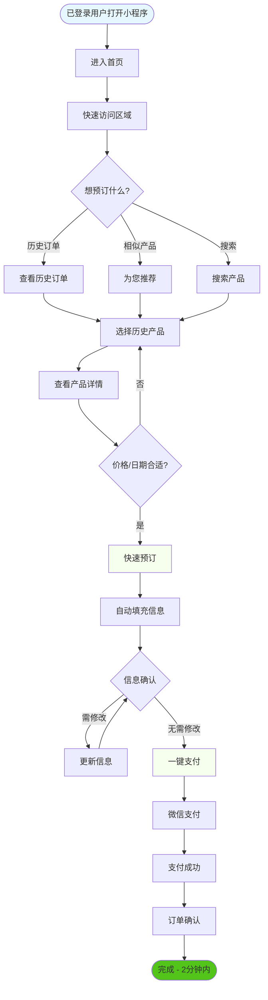
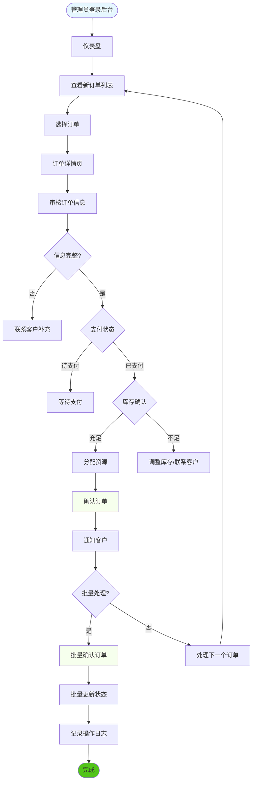
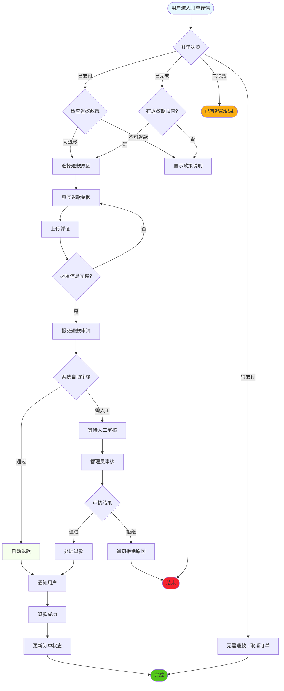

# UX Design Specification bmad

**Author:** Zhang
**Date:** 2026-01-10

---

## Executive Summary

### Project Vision

**bmad** 是一个连接家长和研学产品提供商的预订平台，致力于为 3-18 岁儿童的家长提供可信赖的研学产品发现和预订服务。

**核心价值主张：**
- 为家长提供集中、透明、可信赖的研学产品选择
- 通过真实评价和平台保障建立信任
- 高效完成从发现到预订的全流程（< 5分钟）
- 为管理员提供强大的产品和订单管理工具

**双平台架构：**
- **家长端：** 微信小程序（便捷、随时可用）
- **管理端：** Next.js 15 Web 后台（功能强大、数据可视化）

### Target Users

**主要用户：家长（用户画像：李静）**

**人口统计特征：**
- 年龄：28-45 岁的职场父母
- 孩子年龄：3-18 岁
- 地域：主要城市及周边地区
- 收入水平：中产及以上

**行为特征：**
- 时间紧张，工作繁忙
- 高度重视孩子教育和全面成长
- 对教育产品价格敏感但愿意为质量付费
- 习惯使用微信进行日常操作
- 对陌生产品信任度低，需要验证和保障

**核心需求：**
- 快速找到符合孩子年龄和兴趣的产品
- 确认产品安全性和可靠性
- 透明的价格和清晰的退改政策
- 便捷的支付和订单管理

**次要用户：管理员**

**人口统计特征：**
- 研学产品提供商的运营人员
- 负责产品管理、订单处理、客户服务

**核心需求：**
- 高效管理产品和库存
- 快速处理订单和退款
- 数据分析支持运营决策
- 批量操作提升工作效率

### Key Design Challenges

**挑战 1：建立信任（最高优先级）**
- 家长对陌生研学产品天然警惕
- 需要通过多维度建立信任：
  - 真实的产品图片和详细介绍
  - 其他家长的评价（MVP 使用导入的历史评价）
  - 清晰的价格和退改规则
  - 专业的平台形象

**挑战 2：高效决策流程**
- 家长时间紧张，需要在短时间内完成决策
- 设计目标：5 分钟内完成浏览 → 选择 → 支付
- 需要优化：
  - 产品列表的信息密度和可读性
  - 搜索和筛选的精准度
  - 产品详情页的信息层次
  - 预订表单的简洁性

**挑战 3：双平台一致性体验**
- 微信小程序（家长端）和 Web 后台（管理端）使用不同的设计规范
- 需要保持：
  - 品牌视觉一致性
  - 交互模式的一致性
  - 数据展示的一致性

**挑战 4：复杂信息简化**
- 产品包含多维度信息：年龄范围、时间、地点、价格、库存等
- 订单包含多种状态：待支付、已支付、已完成、已取消、退款中等
- 需要将复杂信息以直观、易懂的方式呈现

### Design Opportunities

**机会 1：视觉化产品展示**
- 使用高质量图片和视频突出产品特色
- 清晰的价格标签和促销信息
- 直观的库存和可预订状态展示
- 地图集成展示活动地点

**机会 2：个性化推荐体验**
- 基于孩子年龄的智能产品推荐
- 基于浏览历史的个性化展示
- "相似产品"推荐提升发现效率

**机会 3：安心保障体验**
- 醒目的退改政策展示
- 实时订单状态跟踪（时间轴展示）
- 友好的错误提示和操作引导
- 一键联系客服功能

**机会 4：管理员效率优化**
- 批量操作界面（批量上架、批量状态更新）
- 拖拽式库存和价格调整
- 可视化数据看板（订单趋势、热门产品）
- 智能预警（库存不足、退款申请提醒）

---

## Core User Experience

### Defining Experience

**bmad 的核心用户行为：** 家长在微信小程序中快速发现合适的研学产品并完成预订（< 5分钟）

**核心价值循环：**
```
发现产品 → 查看详情 → 建立信任 → 快速预订 → 支付完成 → 订单跟踪 → 成为回头客
```

**关键设计目标：**
- **速度：** 5分钟内完成从浏览到支付的全流程
- **信任：** 每个触点都建立可靠性和专业性
- **简单：** 减少认知负担，让快速决策成为可能

**MVP 阶段聚焦：**
- 优化产品发现和预订核心流程
- 建立基础信任机制
- 确保关键功能稳定可用

### Platform Strategy

**双平台架构：**

**家长端 - 微信小程序**
- 交互方式：触摸优先，支持单手操作
- 设计规范：遵循微信小程序设计指南
- 关键特性：
  - 即开即用，无需下载安装
  - 与微信生态深度集成（登录、支付、通知）
  - 移动优先，竖屏设计
  - 考虑网络条件（加载优化）
  - 页面加载 < 2秒

**管理端 - Next.js Web 后台**
- 交互方式：鼠标/键盘，桌面操作
- 设计规范：shadcn/ui 组件库（Radix UI + Tailwind）
- 关键特性：
  - 功能密集，数据可视化
  - 批量操作能力
  - 响应式设计（支持不同屏幕）
  - 实时数据更新
  - 支持高并发操作

**跨平台一致性：**
- 统一的品牌视觉识别
- 一致的信息架构
- 同步的数据状态

### Effortless Interactions

**1. 一键微信登录**
- 用户无需输入账号密码
- 自动获取用户基本信息（昵称、头像）
- 登录状态持久化（7天免登录）
- 无感知 token 刷新

**2. 智能产品推荐**
- 基于孩子年龄自动筛选合适产品
- 个性化推荐基于浏览历史
- "为您推荐"减少搜索时间
- 热门产品置顶展示

**3. 极简预订表单**
- 自动填充已有信息（联系人、孩子信息）
- 只需输入必要的新信息
- 表单验证实时反馈
- 智能默认值（如：孩子年龄、参与人数）

**4. 实时状态更新**
- 订单状态自动刷新（WebSocket 或轮询）
- 支付结果即时显示
- 库存变化实时提醒
- 通知消息即时推送

**5. 智能搜索和筛选**
- 关键词自动补全
- 多条件筛选组合（价格、年龄、类别、地点）
- 筛选结果即时更新
- 历史搜索记录

**6. 管理员批量操作**
- 多选订单批量处理
- 拖拽调整产品排序
- 批量上架/下架产品
- 一键导出数据报表

### Critical Success Moments

**时刻 1：首次信任建立（进入产品详情页）**
- **用户感受：** "这个看起来靠谱"
- **设计要素：**
  - 高质量产品图片（多角度展示）
  - 清晰的价格信息（原价、优惠价）
  - 其他家长的真实评价
  - 专业的内容排版
  - 明确的退改规则
  - 活动地点和时长信息

**时刻 2：快速找到心仪产品（搜索/筛选结果）**
- **用户感受：** "这就是我要找的！"
- **设计要素：**
  - 精准的搜索结果
  - 清晰的产品卡片信息（图片、标题、价格、库存）
  - 一键筛选组合
  - 相关度排序
  - 无结果时的友好提示

**时刻 3：决策并开始预订（点击"立即预订"）**
- **用户感受：** "就选这个了"
- **设计要素：**
  - 清晰的 CTA 按钮
  - 关键信息摘要（日期、价格、库存）
  - 最小化预订表单
  - 即时表单验证
  - 保存为草稿功能

**时刻 4：流畅支付完成（支付成功页面）**
- **用户感受：** "太方便了，搞定了！"
- **设计要素：**
  - 清晰的订单确认信息
  - 一键微信支付
  - 支付处理状态动画
  - 成功页面激励（"预订成功！"）
  - 订单详情入口

**时刻 5：订单状态确认（收到通知）**
- **用户感受：** "预订成功了，很放心"
- **设计要素：**
  - 微信订阅消息通知
  - 订单详情清晰展示
  - 活动前24小时提醒
  - 一键联系客服

**时刻 6：管理员高效操作（批量处理订单）**
- **用户感受：** "工作效率提升了很多"
- **设计要素：**
  - 批量选择和操作
  - 拖拽式状态更新
  - 实时数据刷新
  - 智能预警提醒（库存不足、退款申请）

**时刻 7：问题解决时刻（联系客服）**
- **用户感受：** "有人帮我解决问题"
- **设计要素：**
  - 显眼的客服入口
  - 常见问题 FAQ
  - 一键拨打电话
  - 在线聊天支持（未来功能）

### Experience Principles

**原则 1：速度优先（Speed First）⚡**
- 页面加载 < 2秒
- 核心流程 < 5分钟
- 减少操作步骤
- 优化每个点击的价值
- 关键数据预加载

**原则 2：信任驱动（Trust-Driven）🛡️**
- 真实展示产品信息
- 透明的价格和政策
- 及时的状态反馈
- 专业的平台形象
- 清晰的退改保障

**原则 3：极简交互（Minimal Friction）✨**
- 减少必填字段
- 智能默认值
- 自动补全和预测
- 清晰的操作引导
- 友好的错误提示

**原则 4：移动优先（Mobile-First for Parents）📱**
- 小程序触摸优化（44px 最小点击区域）
- 单手操作友好（重要操作在屏幕下半部分）
- 竖屏信息层次（关键信息优先）
- 离线缓存支持（产品列表、订单）

**原则 5：数据赋能（Data-Empowered for Admins）📊**
- 可视化数据展示（图表、趋势）
- 实时运营指标
- 智能预警系统
- 批量操作能力
- 数据导出功能

**原则 6：一致性体验（Consistent Experience）🎨**
- 跨平台品牌一致性
- 交互模式一致性
- 术语使用一致性
- 状态反馈一致性

---

## Desired Emotional Response

### Primary Emotional Goals

**家长端情感目标：放心 + 高效**

> **情感标语：** "快速找到靠谱的研学产品，轻松完成预订，全程安心无忧"

**核心情感体验：**
- **信任感：** "这个平台很专业，产品真实可靠"
- **轻松感：** "这么快就搞定了，太方便了"
- **安心感：** "订单状态清清楚楚，有保障"
- **惊喜感：** "这个产品正好符合我孩子的年龄"

**管理员端情感目标：掌控 + 高效**

> **情感标语：** "全面掌控运营数据，高效处理业务工作"

**核心情感体验：**
- **掌控感：** "所有数据一目了然，运营状况实时掌握"
- **高效感：** "批量处理太方便了，工作效率大幅提升"
- **成就感：** "运营指标在增长，工作有成效"

### Emotional Journey Mapping

#### **家长情感旅程**

| 用户阶段 | 目标情感 | 触发场景 | 设计支持 |
|----------|----------|----------|----------|
| **发现阶段** | 好奇、期待 | 浏览产品列表 | 精美产品卡片、推荐标签 |
| **探索阶段** | 有信心、感兴趣 | 查看产品详情 | 详细介绍、真实评价、价格透明 |
| **决策阶段** | 信任、心动 | 开始预订流程 | 清晰 CTA、信息摘要、极简表单 |
| **行动阶段** | 轻松、顺畅 | 填写表单、支付 | 智能填充、一键支付、实时反馈 |
| **完成阶段** | 满意、惊喜 | 支付成功 | 成功动画、订单确认、激励文案 |
| **等待阶段** | 安心、期待 | 等待出行 | 状态跟踪、进度条、出行提醒 |
| **体验阶段** | 享受、认可 | 孩子参加活动 | 活动照片分享、评价邀请 |
| **回顾阶段** | 满意、忠诚 | 查看订单、评价 | 订单历史、评价系统、推荐奖励 |
| **问题阶段** | 被关心、有支持 | 联系客服 | 显眼客服入口、快速响应、问题解决 |

#### **管理员情感旅程**

| 用户阶段 | 目标情感 | 触发场景 | 设计支持 |
|----------|----------|----------|----------|
| **开始工作** | 准备就绪 | 打开后台 | 数据概览、待办事项、快捷入口 |
| **查看数据** | 掌控感 | 查看仪表盘 | 可视化图表、实时指标、趋势分析 |
| **处理订单** | 高效感 | 批量处理订单 | 批量选择、拖拽操作、快捷键 |
| **管理产品** | 创造感 | 编辑产品信息 | 即时预览、拖拽排序、图片上传 |
| **处理问题** | 成就感 | 解决退款申请 | 智能提示、一键处理、记录归档 |
| **结束工作** | 满足感 | 完成任务 | 完成反馈、数据统计、成就展示 |

### Micro-Emotions

**需要培养的积极微情感：**

**1. 信任感 vs. 怀疑感** 🛡️
- **设计方法：** 真实产品图片、用户真实评价、透明价格政策、清晰退改规则
- **关键触点：** 产品详情页、评价展示、价格展示、政策说明

**2. 自信感 vs. 困惑感** 💡
- **设计方法：** 清晰的信息架构、明确的操作引导、即时表单验证、友好的错误提示
- **关键触点：** 导航设计、表单填写、错误页面

**3. 轻松感 vs. 紧张感** 😌
- **设计方法：** 智能默认值、自动填充、进度指示、保存草稿
- **关键触点：** 预订表单、支付流程、多步骤操作

**4. 惊喜感 vs. 无聊感** 🎉
- **设计方法：** 个性化推荐、优惠提示、微动画、成功庆祝
- **关键触点：** 首页推荐、支付成功页面、订单完成

**5. 掌控感 vs. 无助感** 🎮
- **设计方法：** 数据可视化、实时更新、批量操作、智能预警
- **关键触点：** 管理后台仪表盘、订单管理、库存管理

**6. 成就感 vs. 挫败感** 🏆
- **设计方法：** 进度反馈、成功庆祝、里程碑标记、积极语言
- **关键触点：** 完成预订、支付成功、订单完成、批量处理

### Design Implications

**情感-设计连接：**

| 情感目标 | UX 设计实现 |
|----------|-------------|
| **信任感** | 高质量产品图片、真实用户评价、透明定价、清晰退改政策、专业的视觉设计 |
| **轻松感** | 极简表单（只填必要信息）、智能默认值、自动填充、一键操作、进度指示 |
| **安心感** | 实时订单状态更新、订单详情页、出行提醒、客服入口、问题解决方案 |
| **惊喜感** | 个性化产品推荐、限时优惠、支付成功动画、新用户欢迎礼、生日提醒 |
| **掌控感** | 可视化数据看板、实时指标更新、批量操作界面、智能预警通知 |
| **高效感** | 键盘快捷键、拖拽排序、批量处理、智能筛选、快速搜索 |
| **自信感** | 清晰导航、操作引导、即时验证、友好错误提示、帮助文档 |
| **成就感** | 完成庆祝、进度反馈、数据增长图表、里程碑标记、积极反馈文案 |

**需要避免的负面情感：**

| 负面情感 | 触发场景 | 设计预防 |
|----------|----------|----------|
| 😰 **焦虑** | 不知道下一步做什么 | 清晰流程指示、进度条 |
| 😫 **困惑** | 不理解界面元素 | 明确标签、引导文案 |
| 😤 **沮丧** | 操作失败、报错 | 友好错误提示、重试机制 |
| 😟 **不信任** | 产品信息不透明 | 真实评价、详细说明 |
| 😒 **失望** | 预期未满足 | 合理预期管理、及时反馈 |
| 🤔 **犹豫** | 不知道如何选择 | 智能推荐、对比工具 |

### Emotional Design Principles

**原则 1：信任驱动设计（Trust-Driven Design）🛡️**
- 真实展示产品信息，不夸大不隐瞒
- 使用真实的用户评价和图片
- 透明的价格和退改政策
- 专业的平台形象和品牌设计
- 及时的客服支持和问题解决

**原则 2：积极情感培养（Positive Emotion Cultivation）✨**
- 在关键成功时刻给予积极反馈
- 使用鼓励性和庆祝性的语言
- 设计微惊喜和愉悦的小细节
- 提供超出预期的体验
- 营造温暖、友好的品牌氛围

**原则 3：负面情感预防（Negative Emotion Prevention）🚫**
- 提前识别可能产生负面情感的触点
- 设计预防措施和降级方案
- 提供清晰的错误解释和解决方案
- 使用友好、理解的错误提示语言
- 确保用户不会感到被指责或无助

**原则 4：情感一致性体验（Emotional Consistency）🎭**
- 跨平台情感体验一致性
- 品牌语言和语调一致性
- 视觉情感表达一致性
- 交互反馈情感一致性
- 服务体验情感一致性

**原则 5：关键时刻情感强化（Critical Moment Amplification）💫**
- 在关键成功时刻强化积极情感
- 支付成功页面的庆祝动画
- 订单确认的激励文案
- 里程碑达成的成就反馈
- 用户忠诚度的奖励机制

**原则 6：情感化微交互（Emotional Micro-interactions）🎨**
- 加载状态的友好提示和动画
- 按钮点击的触觉反馈（如果支持）
- 操作完成的视觉确认
- 错误时的友好解释和引导
- 成功时的庆祝动画和反馈

---

## UX Pattern Analysis & Inspiration

### Inspiring Products Analysis

**1. 携程旅行 - 小程序**

**UX成功要素：**
- 清晰的产品卡片设计，信息层次分明
- 智能日期选择器，日期可用性一目了然
- 一键预订流程，最小化输入
- 实时库存状态显示
- 清晰的价格明细（原价、优惠价、总价）

**适用原因：**
- 同样的预订流程模型
- 目标用户相似（注重效率的消费者）
- 时间敏感的决策场景

**可借鉴元素：**
- 产品卡片布局
- 日期选择交互
- 价格展示策略
- 库存状态设计

**2. 大众点评 / 美团**

**UX成功要素：**
- 强大的筛选和排序功能
- 多维度产品评价系统
- 清晰的价格区间标识
- "附近"功能，地理位置智能推荐
- 用户真实评价的展示策略
- 优惠券和促销的醒目展示

**适用原因：**
- 本地服务预订平台
- 评价驱动决策模式
- 需要快速找到合适产品

**可借鉴元素：**
- 筛选器设计
- 评价展示系统
- 地理位置推荐
- 促销信息展示

**3. 小红书**

**UX成功要素：**
- 瀑布流内容发现体验
- 高质量图片优先展示
- 基于兴趣的智能推荐
- 社区氛围营造
- 用户生成内容的展示

**适用原因：**
- 视觉驱动的产品发现
- 建立信任的内容模式
- 年轻父母用户群体重叠

**可借鉴元素：**
- 视觉优先的内容布局
- 基于兴趣的推荐算法
- 真实用户分享的展示
- 社区氛围设计

**4. 拼多多**

**UX成功要素：**
- 极简的购买流程
- 社交分享激励机制
- 清晰的价格优势展示
- 一键购买按钮
- 限时优惠的紧迫感设计

**适用原因：**
- 优化转化率的设计
- 移动优先的交互
- 价格敏感用户群体

**可借鉴元素：**
- 极简购买流程
- 紧迫感设计（库存、时间限制）
- 一键操作
- 社交元素

**5. 微信小程序 - 通用设计模式**

**UX成功要素：**
- 底部Tab导航（最多5个）
- 顶部搜索栏固定
- 下拉刷新和上滑加载
- 原生组件的流畅体验
- 微信支付的无缝集成

**适用原因：**
- 必须遵循微信小程序规范
- 用户已经熟悉的交互模式
- 与微信生态深度集成

**可借鉴元素：**
- 导航结构
- 刷新和加载模式
- 微信支付集成
- 订阅消息通知

### Transferable UX Patterns

**导航模式：**

1. **底部Tab导航**（小程序）
   - 首页、分类、订单、我的
   - 图标 + 文字标签
   - 当前页面高亮显示

2. **侧边栏导航**（管理后台）
   - 可折叠的多级菜单
   - 面包屑导航
   - 快捷操作入口

**交互模式：**

1. **卡片式产品列表**
   - 图片占卡片上半部分
   - 标题、价格、库存信息在下半部分
   - 点击整个卡片进入详情
   - 右滑或左滑显示快捷操作

2. **智能筛选器**
   - 多条件组合筛选（年龄、价格、类别、地点）
   - 筛选结果实时更新
   - 已选筛选条件标签化显示
   - 一键清除所有筛选

3. **滑动选择器**
   - 日期选择（滚轮式）
   - 年龄选择（滑动条）
   - 数量选择（+/- 按钮）

4. **下拉刷新和分页加载**
   - 下拉刷新获取最新数据
   - 滑动到底部自动加载更多
   - 加载动画和进度提示

**视觉模式：**

1. **高质量图片优先**
   - 产品列表使用大图
   - 多图轮播展示产品细节
   - 图片懒加载优化性能

2. **价格突出显示**
   - 促销价格放大并使用醒目颜色
   - 原价使用删除线
   - 价格单位清晰标注

3. **库存状态标识**
   - "充足"（绿色）
   - "紧张"（橙色）
   - "已售罄"（灰色，不可选）

4. **信任标识**
   - "平台认证"徽章
   - "退款保障"标签
   - 评价星级和数量显示

### Anti-Patterns to Avoid

**1. 信息过载**
- **问题：** 产品详情页塞入过多信息，用户难以快速获取关键信息
- **避免方法：**
  - 信息分层设计
  - 使用折叠/展开隐藏次要信息
  - 进阶信息放在"更多详情"中

**2. 隐藏费用**
- **问题：** 价格展示不透明，结算时出现额外费用
- **避免方法：**
  - 清晰的价格明细
  - 总价始终可见
  - 退改政策提前说明

**3. 复杂表单**
- **问题：** 预订表单字段过多，填写耗时
- **避免方法：**
  - 只收集必要信息
  - 智能默认值和自动填充
  - 分步表单（如必须多字段）

**4. 筛选结果混乱**
- **问题：** 筛选后结果不符合预期，排序逻辑不清晰
- **避免方法：**
  - 筛选条件互斥性检查
  - 清晰的排序说明
  - 无结果时提供友好提示

**5. 加载缓慢**
- **问题：** 页面加载时间长，用户体验差
- **避免方法：**
  - 图片懒加载
  - 骨架屏占位
  - 数据预加载和缓存
  - 页面加载 < 2秒目标

**6. 不可逆操作**
- **问题：** 重要操作没有二次确认，容易误操作
- **避免方法：**
  - 关键操作前弹窗确认
  - 提供"撤销"功能（如可能）
  - 清晰的操作按钮文案

**7. 错误提示不友好**
- **问题：** 技术性错误代码，用户不理解
- **避免方法：**
  - 使用用户友好的错误语言
  - 提供解决方案或下一步建议
  - 错误状态下的视觉引导

### Design Inspiration Strategy

**应该直接采纳（Adopt）：**

✅ **卡片式产品列表**
- 信息清晰，易于扫描
- 触摸友好的交互区域
- 用户熟悉的模式

✅ **智能年龄筛选**
- 核心筛选维度
- 简化产品发现流程
- 提升匹配精准度

✅ **极简预订表单**
- 只收集必要信息
- 智能默认值
- 自动填充已有数据

✅ **实时库存状态**
- 建立紧迫感（库存紧张）
- 避免无效点击（已售罄）
- 透明化产品可用性

✅ **微信一键支付**
- 无缝集成微信支付
- 最小化支付步骤
- 提升转化率

✅ **评价信任系统**
- 真实用户评价展示
- 评级可视化（星级）
- 评价数量显示（建立规模感）

**需要适配调整（Adapt）：**

🔄 **个性化推荐算法**
- 借鉴小红书兴趣推荐思路
- 适配研学产品场景
- 基于孩子年龄、历史订单、浏览行为

🔄 **社交分享激励**
- 借鉴拼多多的社交元素
- 适配研学产品的口碑传播特点
- 邀请好友获得优惠券或积分

🔄 **地理位置推荐**
- 借鉴美团的"附近"功能
- 适配研学产品的地域特性
- 推荐离家近或交通便利的产品

🔄 **内容社区**
- 借鉴小红书的社区氛围
- 适配研学产品的分享需求
- 活动照片分享、体验心得

**应该明确避免（Avoid）：**

❌ **过度营销弹窗**
- 避免频繁的营销信息推送
- 保持用户体验优先
- 精准而非频繁的触达

❌ **虚假紧迫感**
- 避免"仅剩1位"的虚假提示
- 库存信息真实可信
- 长期信任优于短期转化

❌ **复杂会员体系**
- MVP阶段避免复杂的会员规则
- 保持简洁明了
- 未来可逐步引入

❌ **过多的个性化追踪**
- 避免过度收集用户数据
- 遵循隐私保护原则
- 必要性优先于数据量

**创新机会：**

💡 **"家长社区"功能**
- 同龄孩子家长的经验分享
- 研学产品推荐和讨论
- 建立平台信任和粘性

💡 **"成长记录"功能**
- 记录孩子参加的研学活动
- 形成孩子的成长档案
- 增强平台粘性和价值

💡 **"智能匹配"功能**
- 基于孩子兴趣和年龄智能推荐
- 减少家长选择负担
- 提升产品匹配度

---

## Design System Foundation

### Design System Choice

**双平台混合策略：**

**家长端 - 微信小程序：**
- **基础：** 微信原生组件 + WeUI 设计规范
- **定制：** 品牌化的设计令牌（颜色、字体、间距）

**管理端 - Next.js Web 后台：**
- **基础：** shadcn/ui + Tailwind CSS
- **定制：** 完全自定义的主题系统

### Rationale for Selection

**选择微信原生组件 + WeUI（家长端）的理由：**

1. **平台一致性体验**
   - 微信用户期望熟悉的交互模式
   - 遵循微信设计规范避免学习成本
   - 与微信生态无缝集成（支付、通知）

2. **开发速度和效率**
   - 原生组件性能最优
   - 开箱即用的成熟组件
   - MVP 阶段快速迭代的关键

3. **维护成本可控**
   - 微信官方持续更新和维护
   - 组件经过广泛测试
   - 社区支持和文档完善

4. **符合用户习惯**
   - 底部 Tab 导航
   - 下拉刷新和上滑加载
   - 原生表单控件

**选择 shadcn/ui（管理端）的理由：**

1. **已在技术栈中确定**
   - 与 Next.js 15 完美集成
   - React Server Components 支持
   - TypeScript 严格模式支持

2. **设计灵活性和控制**
   - 完全可定制的组件
   - 复制到项目中的完整代码
   - 无运行时依赖，完全掌控

3. **高质量组件**
   - 基于 Radix UI 原语
   - 内置无障碍支持
   - 现代化的设计美学

4. **开发体验优秀**
   - Tailwind CSS 集成
   - CLI 工具快速添加组件
   - 优秀的文档和示例

### Implementation Approach

**阶段 1：建立设计令牌（Design Tokens）**

跨平台统一的设计基础：

```
颜色系统：
- 主色：#1890ff（品牌蓝）
- 辅助色：#52c41a（成功绿）、#faad14（警告橙）、#f5222d（错误红）
- 中性色：灰度色阶 #ffffff → #000000

字体系统：
- 主要字体：-apple-system, BlinkMacSystemFont, "Segoe UI", Roboto
- 小程序：微信默认字体栈
- 字号：12px, 14px, 16px, 18px, 20px, 24px, 32px

间距系统：
- 基础单位：4px
- 间距倍数：4, 8, 12, 16, 20, 24, 32, 40, 48px

圆角系统：
- 小圆角：4px（按钮、输入框）
- 中圆角：8px（卡片）
- 大圆角：12px（模态框）

阴影系统：
- 轻微：用于悬浮卡片
- 中等：用于下拉菜单
- 重大：用于模态框
```

**阶段 2：家长端实现**

```yaml
设计规范：微信小程序设计指南
核心组件：
  - 导航：底部 Tab 导航（首页、分类、订单、我的）
  - 列表：卡片式产品列表
  - 表单：原生表单控件 + 自定义样式
  - 按钮：主要按钮（品牌色）、次要按钮（灰色边框）
  - 弹窗：wx.showModal, wx.showToast

定制化：
  - 品牌色应用到主要按钮和链接
  - 自定义导航栏样式
  - 统一的图标库（使用 iconfont）
  - 统一的动画和过渡效果
```

**阶段 3：管理端实现**

```yaml
技术栈：shadcn/ui + Tailwind CSS + Radix UI
核心组件：
  - 布局：侧边栏导航 + 顶部栏
  - 数据展示：Table, Card, Metric
  - 表单：Form, Input, Select, DatePicker
  - 反馈：Alert, Toast, Dialog
  - 导航：Breadcrumb, Tabs, Pagination

主题配置：
  - 在 tailwind.config.js 中定义设计令牌
  - 使用 CSS 变量实现主题切换
  - 自定义 shadcn/ui 组件样式
  - 创建可复用的组件组合
```

**阶段 4：一致性保障**

```
跨平台一致性措施：
1. 统一的设计令牌文档
2. 交互模式指南（导航、表单、反馈）
3. 组件使用规范
4. 设计评审流程
5. 代码组件库（共享样式和工具函数）
```

### Customization Strategy

**品牌化定制（两个平台统一）：**

1. **颜色应用层次**
   ```
   品牌主色（#1890ff）：
   - 主要操作按钮
   - 链接文本
   - 选中状态
   - 进度条

   功能色：
   - 成功：#52c41a（订单成功、库存充足）
   - 警告：#faad14（库存紧张、退款处理中）
   - 错误：#f5222d（订单失败、售罄）
   - 信息：#1890ff（提示信息）
   ```

2. **图标系统**
   ```
   - 使用 iconfont 创建品牌图标库
   - 统一的图标风格（线性、填充、圆角）
   - 跨平台使用相同图标集
   ```

3. **微交互和动画**
   ```
   统一的交互反馈：
   - 按钮点击反馈（缩放动画）
   - 页面切换过渡（淡入淡出）
   - 加载状态（骨架屏）
   - 成功操作（勾选动画）
   - 错误提示（震动反馈）
   ```

4. **内容设计规范**
   ```
   - 统一的语调和语言风格
   - 友好、专业、简洁的文案
   - 一致的错误提示语言
   - 统一的成功反馈文案
   ```

**家长端特有定制：**

```yaml
微信小程序特殊优化：
  - 适配安全区域（iPhone 刘海屏）
  - 优化长列表性能（虚拟列表）
  - 图片懒加载和压缩
  - 离线缓存策略
  - 页面预加载

与微信集成：
  - 微信登录（一键授权）
  - 微信支付（原生支付）
  - 订阅消息（订单通知）
  - 客服消息（客服咨询）
  - 分享功能（推荐给好友）
```

**管理端特有定制：**

```yaml
shadcn/ui 深度定制：
  - 自定义组件变体（如：紧凑型表格）
  - 创建业务特定组件（如：订单状态标签）
  - 集成数据可视化（如：图表组件）
  - 批量操作组件（如：批量选择器）
  - 拖拽排序组件（如：产品排序）

性能优化：
  - Server Components 优化首屏加载
  - 虚拟滚动处理大量数据
  - 图片优化（next/image）
  - 代码分割和懒加载
```

**未来扩展性：**

```
可扩展的设计系统架构：
1. 设计令牌工具化（Figma 插件、CSS-in-JS）
2. 组件文档化（Storybook）
3. 设计系统网站（内部使用）
4. 自动化测试（视觉回归测试）
5. 持续集成（设计更新自动同步）
```

---

## Core User Experience Definition

### Defining Experience

**bmad 的定义性体验：** "在5分钟内完成发现 → 信任 → 预订的全流程"

这不是单一的操作，而是一个流畅的端到端体验。用户会这样向朋友描述：
> "我在微信里打开这个小程序，几分钟就找到了适合我孩子的研学活动，看完评价和价格，直接微信支付就搞定了！"

**核心价值主张：**
- 快速发现合适产品（< 30秒）
- 建立信任和信心（< 1分钟）
- 完成预订和支付（< 3分钟）
- 总计 < 5分钟

### User Mental Model

**当前解决方案的痛点：**
- 信息分散在微信群、朋友圈、多个平台
- 缺乏真实评价，难以判断质量
- 需要打电话或加微信咨询，效率低
- 价格和退改政策不透明
- 预订流程繁琐，需要多次沟通

**用户带来的心智模型：**
- 期望像美团/携程那样快速找到产品
- 习惯卡片式浏览和筛选
- 期望看到真实评价建立信任
- 期望一键支付完成预订

**用户容易困惑的领域：**
- 研学产品的质量如何判断？
- 价格是否包含所有费用？
- 退改政策是什么？
- 孩子的年龄是否适合这个活动？

**成功的设计将：**
- 利用用户熟悉的模式（卡片列表、筛选、评价）
- 在关键触点建立信任（真实评价、透明价格、明确政策）
- 最小化输入，最大化系统智能

### Success Criteria

**定量成功指标：**
- 从打开小程序到支付成功 < 5分钟（80分位）
- 在产品列表页找到合适产品点击次数 < 5次
- 表单填写完成率 > 80%
- 支付成功率 > 90%
- 首次用户完成率 > 60%

**定性成功标准：**

**1. "这就是我要找的！"（发现阶段）**
- 筛选结果精准匹配需求
- 产品卡片信息清晰易读
- 推荐产品符合孩子年龄

**2. "这个看起来靠谱"（信任阶段）**
- 高质量产品图片
- 真实用户评价可见
- 价格和退改政策透明
- 平台认证和保障信息

**3. "太方便了"（预订阶段）**
- 表单自动填充已有信息
- 只需输入必要信息
- 表单验证实时友好
- 一键支付顺畅

**4. "搞定了，很放心"（完成阶段）**
- 支付成功页面激励
- 订单确认信息清晰
- 即时通知送达
- 客服入口显眼

### Novel vs. Established UX Patterns

**采用成熟的 UX 模式：**

✅ **产品发现：**
- 卡片式产品列表（美团、携程模式）
- 底部 Tab 导航（微信小程序标准）
- 滑动刷新和分页加载（用户熟悉）

✅ **产品详情：**
- 图片轮播展示（电商标准）
- 评价星级和数量（通用模式）
- 价格和库存显示（预订平台标准）

✅ **预订流程：**
- 极简表单设计（现代最佳实践）
- 一键微信支付（微信生态标准）

**创新组合：**

🔄 **智能推荐系统：**
- 基于孩子年龄的自动筛选
- 基于历史行为的个性化推荐
- "为您推荐"标签区分

🔄 **信任建立机制：**
- 将评价展示放在详情页显著位置
- "平台认证"和"退款保障"徽章
- 清晰的退改政策前置

🔄 **智能通知系统：**
- 订单状态实时更新
- 出发前24小时提醒
- 订单变化即时通知

### Core Experience Mechanics

#### 阶段 1：发现

**触发条件：**
- 用户打开小程序
- 自动加载推荐产品

**用户操作：**
1. 浏览产品卡片（图片、标题、价格、库存状态）
2. 使用筛选器（年龄范围、价格区间、类别、地点）
3. 点击产品卡片或"查看详情"按钮

**系统反馈：**
- 筛选结果即时更新（< 500ms）
- 库存状态实时显示
- "为您推荐"标签标识智能推荐产品
- 无结果时显示友好提示

**成功标志：**
- 用户点击进入产品详情页
- 停留时间 > 5秒（表示认真浏览）

#### 阶段 2：探索和信任建立

**触发条件：**
- 用户点击产品卡片

**用户操作：**
1. 滑动查看产品图片轮播
2. 阅读产品详细介绍
3. 查看用户评价（星级、评论、图片）
4. 查看价格和退改政策
5. 选择活动日期和参与人数

**系统反馈：**
- 高质量图片流畅加载
- 评价数量和星级显著显示
- 可选日期的视觉指示（可用/已满）
- 价格实时更新（根据日期和人数）
- "退款保障"徽章显示

**成功标志：**
- 用户查看多个图片
- 用户阅读评价（滚动到评价区域）
- 用户点击"立即预订"按钮

#### 阶段 3：决策和预订

**触发条件：**
- 用户点击"立即预订"按钮

**用户操作：**
1. 查看预订摘要（产品、日期、人数、价格）
2. 填写或确认联系人信息
3. 填写或确认孩子信息
4. 一键微信支付

**系统反馈：**
- 表单自动填充已有信息
- 实时表单验证（格式、完整性）
- 支付处理动画
- "预订成功！"确认页面

**成功标志：**
- 表单填写完成率 > 80%
- 支付成功，跳转到订单详情
- 收到微信订阅消息通知

#### 阶段 4：确认和跟踪

**触发条件：**
- 支付成功后

**用户操作：**
1. 查看订单确认信息
2. 查看订单详情页
3. （可选）分享给朋友

**系统反馈：**
- 订单状态时间轴可视化
- 微信订阅消息即时送达
- 订单详情清晰展示

**成功标志：**
- 用户停留查看订单详情
- 用户未立即取消订单
- 用户对预订感到满意

#### 优化机制

**性能优化：**
- 页面加载 < 2秒
- 图片懒加载和压缩
- 骨架屏占位
- 关键数据预加载

**容错机制：**
- 网络错误时友好提示
- 支付失败时重试机制
- 订单创建失败时保存草稿
- 库存不足时及时通知

**智能辅助：**
- 自动记住用户偏好
- 智能默认值（日期、人数）
- 基于历史的相似产品推荐
- 个性化内容排序

---

## Visual Design Foundation

### Color System

**品牌主色调：信任蓝**

选择蓝色的原因：
- 蓝色传达信任、专业和可靠
- 教育和科技行业广泛使用
- 与微信生态和谐共存
- 适合家长对研学产品的期望

**主色系（品牌蓝）：**
```css
--primary: #1890ff;              /* 主色 */
--primary-hover: #40a9ff;         /* 悬停状态 */
--primary-active: #096dd9;        /* 激活状态 */
--primary-light: #e6f7ff;         /* 浅色背景 */
--primary-lighter: #bae7ff;       /* 更浅背景 */
```

**功能色系：**
```css
--success: #52c41a;               /* 成功 - 订单成功、库存充足 */
--success-light: #f6ffed;         /* 成功浅色背景 */
--warning: #faad14;               /* 警告 - 库存紧张、退款处理中 */
--warning-light: #fffbe6;         /* 警告浅色背景 */
--error: #f5222d;                 /* 错误 - 订单失败、售罄 */
--error-light: #fff1f0;           /* 错误浅色背景 */
--info: #1890ff;                  /* 信息 - 提示信息 */
--info-light: #e6f7ff;            /* 信息浅色背景 */
```

**中性色系（灰度系统）：**
```css
/* 文本颜色 */
--text-primary: #262626;          /* 主要文本 */
--text-secondary: #595959;        /* 次要文本 */
--text-tertiary: #8c8c8c;         /* 辅助文本 */
--text-quaternary: #bfbfbf;       /* 禁用文本 */
--text-placeholder: #bfbfbf;      /* 占位符文本 */

/* 背景颜色 */
--bg-page: #fafafa;               /* 页面背景 */
--bg-component: #ffffff;          /* 组件背景 */
--bg-container: #ffffff;          /* 容器背景 */

/* 边框颜色 */
--border-color: #d9d9d9;          /* 边框 */
--border-color-light: #f0f0f0;    /* 浅色边框 */
--divider-color: #f0f0f0;         /* 分割线 */
```

**语义化颜色映射：**

| 用途 | 颜色 | 应用场景 |
|------|------|----------|
| **主要操作** | Primary (#1890ff) | 立即预订、支付、提交 |
| **成功状态** | Success (#52c41a) | 订单成功、库存充足、操作成功 |
| **警告状态** | Warning (#faad14) | 库存紧张、退款处理中 |
| **错误状态** | Error (#f5222d) | 订单失败、售罄、操作失败 |
| **信息提示** | Info (#1890ff) | 提示信息、帮助文本 |

**无障碍对比度：**
- 主色与白色对比度：4.5:1 (WCAG AA 合格)
- 文本与背景对比度：≥ 4.5:1 (WCAG AA 标准)
- 重要文本对比度：≥ 7:1 (WCAG AAA 标准)

### Typography System

**字体选择：**

**家长端（微信小程序）：**
```css
font-family: -apple-system, BlinkMacSystemFont, "Segoe UI", Roboto,
             "Helvetica Neue", Arial, sans-serif;
```
- 使用微信默认字体栈
- 系统字体优先，保证加载速度
- 兼容 iOS 和 Android

**管理端（Next.js Web）：**
```css
font-family: -apple-system, BlinkMacSystemFont, "Segoe UI", Roboto,
             "Helvetica Neue", Arial, "Noto Sans", sans-serif;
```
- 现代系统字体栈
- 跨平台一致性
- 优先使用系统字体提升性能

**字号层级：**

```css
/* 标题层级 */
--font-size-h1: 32px;             /* 页面主标题 */
--font-size-h2: 24px;             /* 区块标题 */
--font-size-h3: 20px;             /* 卡片标题 */
--font-size-h4: 18px;             /* 小标题 */

/* 正文层级 */
--font-size-large: 16px;          /* 正文大 */
--font-size-base: 14px;           /* 正文默认 */
--font-size-small: 12px;          /* 辅助文本 */
```

**字重系统：**

```css
--font-weight-normal: 400;        /* Regular */
--font-weight-medium: 500;        /* Medium */
--font-weight-semibold: 600;      /* Semibold */
--font-weight-bold: 700;          /* Bold */
```

**行高系统：**

```css
--line-height-title: 1.2;         /* 标题行高 */
--line-height-base: 1.5;          /* 正文行高 */
--line-height-loose: 1.6;         /* 宽松行高 */
```

**字体使用指南：**

| 元素 | 字号 | 字重 | 行高 | 使用场景 |
|------|------|------|------|----------|
| H1 | 32px | Semibold (600) | 1.2 | 页面主标题 |
| H2 | 24px | Semibold (600) | 1.2 | 区块标题 |
| H3 | 20px | Medium (500) | 1.3 | 卡片标题 |
| H4 | 18px | Medium (500) | 1.3 | 小标题 |
| Body Large | 16px | Normal (400) | 1.5 | 重要正文 |
| Body Base | 14px | Normal (400) | 1.5 | 默认正文 |
| Body Small | 12px | Normal (400) | 1.5 | 辅助文本、注释 |

### Spacing & Layout Foundation

**间距系统：**

**基础单位：4px**

```
间距倍数：4, 8, 12, 16, 20, 24, 32, 40, 48px
```

```css
/* 间距变量 */
--spacing-xs: 4px;                /* 极小间距 - 元素内部紧凑间距 */
--spacing-sm: 8px;                /* 小间距 - 相关元素间距 */
--spacing-md: 12px;               /* 中间距 - 卡片内元素间距 */
--spacing-base: 16px;             /* 标准间距 - 默认间距 */
--spacing-lg: 20px;               /* 大间距 - 卡片内边距 */
--spacing-xl: 24px;               /* 更大间距 - 区块间距 */
--spacing-xxl: 32px;              /* 超大间距 - 大区块间距 */
--spacing-xxxl: 48px;             /* 极大间距 - 页面级间距 */
```

**间距应用场景：**

| 间距值 | 应用场景 | 示例 |
|--------|----------|------|
| 4px | 元素内部紧凑间距 | 图标与文字间距 |
| 8px | 相关元素间距 | 表单字段间距 |
| 12px | 卡片内元素间距 | 列表项内元素 |
| 16px | 标准间距 | 段落间距 |
| 20px | 卡片内边距 | 卡片内容与边框 |
| 24px | 区块间距 | 区块之间 |
| 32px | 大区块间距 | 主要章节之间 |
| 48px | 页面级间距 | 页面顶部与内容 |

**布局原则：**

**家长端（微信小程序）：**

```yaml
布局结构：
  - 屏幕宽度：100vw（视口宽度）
  - 底部 Tab 导航：固定 50px 高度
  - 顶部导航栏：固定 44px 高度
  - 内容区域：自适应剩余高度
  - 安全区域：适配 iPhone 刘海屏

内容布局：
  - 单列内容为主
  - 卡片式设计
  - 横向滚动（推荐产品）
  - 纵向滚动（产品列表）

响应式断点：
  - 小屏：< 375px（iPhone SE）
  - 标准：375px - 428px（大部分手机）
  - 大屏：> 428px（iPhone Pro Max）
```

**管理端（Next.js Web）：**

```yaml
布局结构：
  - 侧边栏导航：固定 240px 宽度
  - 侧边栏折叠：64px 宽度
  - 顶部栏：固定 64px 高度
  - 内容区域：自适应剩余空间
  - 最大内容宽度：1440px

响应式断点：
  - 桌面：> 1024px（主要支持）
  - 平板：768px - 1024px（次要支持）
  - 移动：< 768px（不推荐）

网格系统：
  - 12列网格
  - 列间距：16px
  - 边距：24px
```

**圆角系统：**

```css
--border-radius-sm: 4px;          /* 小圆角 - 按钮、输入框、标签 */
--border-radius-base: 8px;        /* 中圆角 - 卡片 */
--border-radius-lg: 12px;         /* 大圆角 - 模态框 */
--border-radius-circle: 50%;      /* 圆形 - 头像、徽章 */
```

**阴影系统：**

```css
--shadow-sm: 0 2px 8px rgba(0, 0, 0, 0.08);      /* 轻微 - 悬浮卡片 */
--shadow-base: 0 4px 16px rgba(0, 0, 0, 0.12);   /* 中等 - 下拉菜单 */
--shadow-lg: 0 8px 32px rgba(0, 0, 0, 0.16);     /* 重大 - 模态框 */
```

**布局模式：**

**1. 卡片布局（通用）**
```
┌─────────────────────────┐
│  [标题]           [操作] │  ← 卡片头部 (padding: 16px)
├─────────────────────────┤
│                         │
│     卡片内容区域         │  ← 卡片内容 (padding: 16px)
│                         │
└─────────────────────────┘
```

**2. 列表布局（产品列表）**
```
┌─────────────────────────┐
│  [图片]  标题             │  ← 列表项 (padding: 12px 16px)
│         价格 | 库存       │
└─────────────────────────┘
```

**3. 表单布局（预订表单）**
```
┌─────────────────────────┐
│  标签                   │  ← 表单字段 (margin-bottom: 16px)
│  [输入框____________]    │
└─────────────────────────┘
```

### Accessibility Considerations

**对比度标准：**

| 元素类型 | 最小对比度 | WCAG 等级 |
|----------|------------|-----------|
| 普通文本（< 18px） | 4.5:1 | AA |
| 普通文本（< 18px） | 7:1 | AAA |
| 大文本（≥ 18px） | 3:1 | AA |
| 大文本（≥ 18px） | 4.5:1 | AAA |
| 图标和图形 | 3:1 | AA |

**当前颜色对比度检查：**
- ✅ Primary (#1890ff) 与白色背景：4.5:1 (AA)
- ✅ 文本 Primary (#262626) 与白色背景：12.6:1 (AAA)
- ✅ 文本 Secondary (#595959) 与白色背景：7.0:1 (AAA)
- ✅ Success (#52c41a) 与白色背景：3.8:1 (需要加深用于文本)
- ✅ Error (#f5222d) 与白色背景：4.5:1 (AA)

**字体大小标准：**
- 正文最小：14px
- 辅助文本最小：12px
- 可缩放至 200% 不影响布局

**点击区域标准：**
- 交互元素最小点击区域：44px × 44px
- 触摸目标最小间距：8px

**键盘导航（管理端）：**
- 所有交互元素可通过 Tab 键访问
- 焦点指示器清晰可见
- Esc 键关闭模态框和下拉菜单
- Enter 和 Space 键激活按钮和链接

**屏幕阅读器支持：**
- 语义化 HTML 标签
- ARIA 标签和角色
- Alt 文本用于图片
- 错误消息关联到表单字段

**颜色无障碍：**
- 颜色不是唯一的信息传达方式
- 使用图标 + 颜色表示状态
- 支持高对比度模式

---

## Design Direction Decision

### Design Directions Explored

我们探索了三个主要的设计方向：

**方向 A：简洁现代风格**
- 参考：Airbnb、携程旅行
- 特征：大量留白、高质量图片主导、精致微交互
- 优势：建立高端专业的品牌形象，符合"信任"情感目标
- 劣势：单屏信息量较少，对图片质量要求高

**方向 B：卡片密集风格**
- 参考：美团、大众点评
- 特征：信息密度高、实用主义、强大的筛选功能
- 优势：信息获取效率高，符合用户习惯
- 劣势：视觉冲击力较弱，给人"工具化"感觉

**方向 C：内容优先风格**
- 参考：小红书
- 特征：大图主导、瀑布流布局、社交化设计
- 优势：视觉吸引力强，适合发现新产品
- 劣势：信息密度低，对用户生成内容依赖强

### Chosen Direction

**采用混合方案：方向 A（简洁现代）+ 方向 B（卡片密集）**

根据不同页面场景采用差异化设计策略：

**首页：简洁现代风格（方向 A）**
- 大图推荐产品，建立品牌形象
- 精致的微交互和动画
- 强调视觉吸引力和品质感
- 培养用户对平台的信任

**列表页：卡片密集风格（方向 B）**
- 信息密度高，提升筛选效率
- 清晰的信息层次，快速比较
- 强大的筛选和排序功能
- 支持高效的产品发现

**详情页：沉浸式视觉（方向 A）**
- 高质量图片轮播
- 渐进式信息披露
- 评价展示突出
- 建立购买信心

### Design Rationale

**选择混合方案的理由：**

1. **符合用户旅程的心理模型**
   - 发现阶段（首页）：需要视觉吸引和品牌信任 → 简洁现代
   - 筛选阶段（列表）：需要效率和比较 → 卡片密集
   - 决策阶段（详情）：需要信心和确认 → 沉浸式视觉

2. **平衡品牌目标和效率需求**
   - 品牌层面：建立专业、可靠、值得信赖的形象
   - 效率层面：支持"5分钟完成"的核心体验目标
   - 情感层面：在"信任"和"高效"之间取得平衡

3. **最大化各页面的转化潜力**
   - 首页：通过视觉吸引力留住用户
   - 列表页：通过高效率减少流失
   - 详情页：通过信任感提升转化

4. **技术实现可行性**
   - 家长端：微信小程序原生组件 + 样式定制
   - 管理端：shadcn/ui 组件库灵活配置
   - 跨平台一致性：统一的设计令牌和组件变体

### Implementation Approach

**家长端（微信小程序）实现策略：**

**首页布局：**
```yaml
顶部区域：
  - 搜索栏：固定顶部，简洁设计
  - 轮播推荐：3-5个精选产品，大图展示

内容区域：
  - 为您推荐：2列卡片，大图展示
  - 热门产品：横向滚动列表
  - 分类入口：图标 + 文字网格

底部导航：
  - 首页、分类、订单、我的（4个Tab）
```

**列表页布局：**
```yaml
顶部：
  - 筛选栏：年龄、价格、类别、地点
  - 排序选项：推荐、最新、价格、评分

内容区域：
  - 产品列表：单列卡片
  - 卡片信息：图片、标题、标签、价格、库存、评分
  - 加载更多：分页或无限滚动

交互优化：
  - 筛选结果实时更新
  - 下拉刷新
  - 加载骨架屏
```

**详情页布局：**
```yaml
顶部：
  - 图片轮播：3-5张高质量图片
  - 返回按钮：左上角固定

内容区域：
  - 产品信息：标题、标签、价格、库存
  - 详细介绍：折叠式内容
  - 用户评价：星级、评论、图片
  - 退改政策：清晰展示

底部固定：
  - 立即预订按钮：主色，醒目
  - 客服入口：右侧
```

**管理端（Next.js）实现策略：**

**仪表盘：**
```yaml
布局：
  - 侧边栏：导航菜单（可折叠）
  - 顶部栏：搜索、通知、用户
  - 内容区：数据卡片、图表、快捷操作

设计元素：
  - shadcn/ui Card 组件
  - 数据可视化（图表库）
  - 批量操作工具栏
```

**产品管理：**
```yaml
列表视图：
  - shadcn/ui Table 组件
  - 紧凑模式，高信息密度
  - 批量选择和操作

编辑表单：
  - 分步表单或标签页
  - 实时预览
  - 图片上传组件
```

**订单管理：**
```yaml
列表视图：
  - shadcn/ui Table 组件
  - 状态标签（颜色编码）
  - 快捷操作按钮

详情视图：
  - 时间轴展示订单状态
  - 操作记录
  - 退款处理界面
```

**组件库设计：**

**通用组件变体：**
```typescript
// 卡片组件
<Card variant="immersive">  // 首页大图卡片
<Card variant="compact">    // 列表页紧凑卡片
<Card variant="detailed">   // 详情页信息卡片

// 按钮组件
<Button variant="primary">   // 主要操作（预订）
<Button variant="secondary"> // 次要操作
<Button variant="ghost">     // 取消/返回

// 列表组件
<List variant="grid">        // 首页网格
<List variant="list">        // 列表页单列
```

**跨平台一致性保障：**
```yaml
设计令牌：
  - 颜色系统统一（CSS 变量）
  - 字体系统统一（字号、字重）
  - 间距系统统一（4px 基础单位）
  - 圆角、阴影统一

组件模式：
  - 相同的信息层次结构
  - 相同的交互模式（点击、滑动）
  - 相同的反馈机制（加载、成功、错误）
```

**性能优化策略：**

**家长端优化：**
```yaml
图片优化：
  - 图片懒加载
  - WebP 格式（如果支持）
  - 缩略图 + 原图分级加载
  - 图片压缩和裁剪

列表优化：
  - 虚拟列表（长列表）
  - 分页加载（每页20条）
  - 骨架屏占位
  - 预加载下一页

缓存策略：
  - 产品列表缓存（5分钟）
  - 产品详情缓存（10分钟）
  - 用户信息持久化
```

**管理端优化：**
```yaml
数据加载：
  - Server Components 优化首屏
  - 数据预加载和并行请求
  - 虚拟滚动（大数据表格）
  - 代码分割和懒加载

渲染优化：
  - React.memo 避免不必要渲染
  - useCallback 稳定函数引用
  - 虚拟化长列表
```

---

## User Journey Flows

### Journey 1: 首次用户发现并预订研学产品

**用户目标：** 在 5 分钟内找到合适的产品并完成预订

**起点：** 用户打开微信小程序

**流程图：**



```mermaid
flowchart TD
    Start([用户打开小程序]) --> Auth[微信一键登录]
    Auth --> Home[进入首页]
    Home --> Decision1{有明确目标?}

    Decision1 -->|是| Search[使用搜索功能]
    Decision1 -->|否| Browse[浏览推荐产品]

    Search --> FilterResults[搜索/筛选结果页]
    Browse --> FilterResults

    FilterResults --> ViewCard[浏览产品卡片]
    ViewCard --> Decision2{感兴趣?}

    Decision2 -->|否| ViewCard
    Decision2 -->|是| ViewDetail[查看产品详情]

    ViewDetail --> CheckImages[查看产品图片]
    CheckImages --> CheckInfo[阅读详细介绍]
    CheckInfo --> CheckReviews[查看用户评价]
    CheckReviews --> CheckPolicy[查看退改政策]

    CheckPolicy --> Decision3{满意且合适?}

    Decision3 -->|否| FilterResults
    Decision3 -->|是| SelectDate[选择日期和人数]

    SelectDate --> CheckStock{库存充足?}
    CheckStock -->|否| SelectDate
    CheckStock -->|是| ClickBook[点击立即预订]

    ClickBook --> BookingForm[预订表单]
    BookingForm --> FillInfo[填写/确认信息]

    FillInfo --> ValidateForm{表单验证}
    ValidateForm -->|失败| FillInfo
    ValidateForm -->|通过| ConfirmPay[确认支付]

    ConfirmPay --> WeChatPay[微信支付]
    WeChatPay --> PayDecision{支付结果}

    PayDecision -->|失败| RetryPay[重试/取消]
    PayDecision -->|成功| SuccessPage[预订成功页]

    SuccessPage --> OrderDetail[查看订单详情]
    OrderDetail --> Notification[收到订阅消息]

    Notification --> End([完成 - 5分钟内])

    style Start fill:#e6f7ff
    style End fill:#52c41a
    style Decision3 fill:#fff1f0
    style PayDecision fill:#fff1f0
    style SuccessPage fill:#f6ffed
```

**关键页面流程：**

| 步骤 | 页面 | 关键操作 | 预期时长 |
|------|------|----------|----------|
| 1 | 首页 | 浏览推荐/使用搜索 | 30秒 |
| 2 | 列表页 | 筛选/浏览产品卡片 | 60秒 |
| 3 | 详情页 | 查看图片/评价/政策 | 90秒 |
| 4 | 预订页 | 填写表单 | 60秒 |
| 5 | 支付页 | 完成支付 | 30秒 |
| **总计** | | | **< 5分钟** |

**关键优化点：**
1. **智能默认值**：自动填充用户信息，减少输入
2. **实时验证**：表单字段即时验证，避免提交后失败
3. **进度指示**：多步骤流程显示进度
4. **草稿保存**：表单自动保存，意外退出可恢复
5. **库存实时检查**：避免选择后才发现库存不足

---

### Journey 2: 已有用户快速重新预订

**用户目标：** 快速重复预订历史产品或相似产品

**起点：** 用户打开小程序（已登录）

**流程图：**



**关键优化点：**
1. **历史订单快捷入口**：首页显示最近订单
2. **智能推荐**：基于历史推荐相似产品
3. **一键重订**：复制历史订单信息
4. **快速支付**：使用保存的支付方式

---

### Journey 3: 管理员处理新订单

**管理员目标：** 高效处理新订单，提供优质服务

**起点：** 管理员登录后台

**流程图：**



**关键优化点：**
1. **批量操作**：支持多选订单批量处理
2. **智能预警**：库存不足、异常订单自动提醒
3. **快捷操作**：订单列表直接操作，无需进入详情
4. **操作记录**：所有操作有记录，便于追溯

---

### Journey 4: 用户申请退款

**用户目标：** 快速、无障碍地申请退款

**起点：** 用户在订单详情页

**流程图：**



**关键优化点：**
1. **政策前置**：订单详情清晰展示退改政策
2. **智能审核**：符合条件的自动退款
3. **进度透明**：退款申请状态实时更新
4. **友好沟通**：拒绝退款时提供详细原因

---

### Journey Patterns

**导航模式：**

1. **底部 Tab 导航**（家长端）
   - 4个主要入口：首页、分类、订单、我的
   - 当前页面高亮显示
   - 图标 + 文字标签

2. **侧边栏导航**（管理端）
   - 可折叠的多级菜单
   - 面包屑导航显示当前位置
   - 快捷操作入口

3. **返回按钮**（详情页）
   - 左上角固定位置
   - 保存并返回提示
   - 滑动返回支持（小程序）

**决策模式：**

1. **渐进式披露**
   - 首次展示必要信息
   - 高级选项折叠隐藏
   - "了解更多"展开详情

2. **智能默认值**
   - 基于历史数据预填
   - 常用选项置顶
   - 一键应用推荐

3. **即时反馈**
   - 表单验证实时提示
   - 操作结果即时显示
   - 加载状态清晰可见

**反馈模式：**

1. **成功反馈**
   - ✅ 勾选动画
   - 成功文案激励
   - 下一步引导

2. **错误反馈**
   - ❌ 友好错误提示
   - 解决方案建议
   - 重试机制

3. **进度反馈**
   - 进度条指示
   - 步骤提示
   - 预计完成时间

---

### Flow Optimization Principles

**1. 最小化步骤到价值**

| 用户类型 | 核心流程 | 最大步骤数 | 目标时长 |
|----------|----------|-----------|----------|
| 首次用户 | 发现并预订 | 5步 | < 5分钟 |
| 回头用户 | 快速重订 | 3步 | < 2分钟 |
| 管理员 | 处理订单 | 4步 | < 1分钟/单 |

**原则：**
- 每屏一主操作，避免选择过多
- 信息分块，每次专注一个任务
- 延迟非必要信息收集

**2. 减少认知负荷**

| 策略 | 实现方法 | 应用场景 |
|------|----------|----------|
| 信息分块 | 每屏 3-5 个关键点 | 表单、详情页 |
| 视觉增强 | 使用图标、颜色 | 列表、状态显示 |
| 模式一致 | 统一交互方式 | 全局导航 |

**3. 提供清晰反馈**

| 反馈类型 | 实现方式 | 应用场景 |
|----------|----------|----------|
| 即时反馈 | 操作动画、状态提示 | 按钮点击、表单验证 |
| 进度反馈 | 进度条、步骤指示 | 多步骤流程、加载 |
| 结果反馈 | 成功/错误页面 | 操作完成 |

**4. 创建愉悦体验**

| 时刻 | 设计方法 | 应用场景 |
|------|----------|----------|
| 微动画 | 轻量级过渡动画 | 页面切换、状态变化 |
| 个性化 | 智能推荐、定制内容 | 首页推荐、表单预填 |
| 意外惊喜 | 优惠券、感谢语 | 支付成功、首次使用 |

**5. 优雅处理错误**

| 错误类型 | 处理策略 | 应用场景 |
|----------|----------|----------|
| 表单错误 | 实时验证、具体提示 | 表单填写 |
| 网络错误 | 友好提示、自动重试 | 数据加载、提交 |
| 业务错误 | 清晰说明、解决方案 | 库存不足、支付失败 |

**错误恢复机制：**
- 保存草稿，避免数据丢失
- 提供撤销/重做功能
- 多种恢复路径
- 友好的错误语言

---

## Component Strategy

### Design System Components

**家长端（微信小程序）- 可用组件：**

| 类别 | 组件 | 用途 |
|------|------|------|
| 视图容器 | view, scroll-view, swiper | 页面布局、滚动、轮播 |
| 基础内容 | text, icon, progress, rich-text | 文本、图标、进度、富文本 |
| 表单组件 | button, input, checkbox, radio, switch, slider, picker | 表单输入、选择 |
| 导航 | navigator, tabBar | 页面跳转、标签栏 |
| 媒体组件 | image, video | 图片、视频 |
| 反馈组件 | toast, modal, loading, action-sheet | 提示、弹窗、加载 |
| 导航栏 | navigation-bar | 顶部导航 |

**管理端（shadcn/ui）- 可用组件：**

| 类别 | 组件 | 用途 |
|------|------|------|
| 布局 | Card, Separator, Container | 卡片、分割线、容器 |
| 表单 | Form, Input, Select, Checkbox, Radio, Switch, Slider, DatePicker | 表单输入、选择 |
| 数据展示 | Table, Badge, Avatar, Progress, Tabs | 表格、徽章、头像、进度、标签页 |
| 反馈 | Alert, Toast, Dialog, Dropdown Menu, Popover | 提示、对话框、下拉菜单 |
| 按钮 | Button（primary, secondary, ghost, outline） | 各种操作按钮 |
| 导航 | Breadcrumb, Pagination | 面包屑、分页 |

### Custom Components

基于用户旅程和设计方向分析，以下是 bmad 项目需要自定义的核心组件：

#### 1. ProductCard（产品卡片）

**目的：** 在产品列表和推荐中展示研学产品信息

**内容结构：**
```
┌─────────────────────┐
│  [图片 - 16:9]       │
│  科学探索营          │  ← 标题
│  ⭐ 4.9 (128)       │  ← 评分
│  6-12岁 | ¥399/人    │  ← 年龄|价格
│  [库存充足]          │  ← 库存状态
└─────────────────────┘
```

**使用场景：**
- 首页推荐产品
- 产品列表页
- 相关产品推荐

**变体：**
- `immersive` - 首页大图卡片（简洁现代风格）
- `compact` - 列表页紧凑卡片（密集风格）
- `detailed` - 详情页相关产品

**状态：**
- 默认状态
- 悬停状态（管理端）
- 加载状态（骨架屏）
- 售罄状态（半透明 + "已售罄"标签）

**无障碍：**
- `role="button"`
- `aria-label="科学探索营，6-12岁，399元每人，库存充足"`
- Tab 键可访问
- Enter/Space 激活

**内容指南：**
- 标题：最多 20 字符
- 评分：显示星级和评价数量
- 价格：使用 PriceDisplay 组件
- 库存：使用 StockIndicator 组件

---

#### 2. StockIndicator（库存状态指示器）

**目的：** 清晰展示产品库存状态，帮助用户决策

**状态定义：**

| 状态 | 条件 | 颜色 | 图标 | 文案 |
|------|------|------|------|------|
| 充足 | 库存 > 10 | 绿色 #52c41a | ✓ | 库存充足 |
| 紧张 | 库存 3-10 | 橙色 #faad14 | ⚠ | 仅剩 N 位 |
| 告急 | 库存 1-2 | 红色 #f5222d | ⚠ | 仅剩 1-2 位 |
| 售罄 | 库存 = 0 | 灰色 #bfbfbf | ✕ | 已售罄 |

**使用场景：**
- 产品卡片
- 产品详情页
- 日期选择器中

**无障碍：**
- `aria-label="库存状态：充足"`
- 颜色 + 图标 + 文本三重提示

---

#### 3. ReviewCard（评价卡片）

**目的：** 展示用户评价，建立信任

**内容结构：**
```
┌─────────────────────────┐
│ [头像] 张妈妈  ⭐⭐⭐⭐⭐ │
│ 2024-01-05              │
│                        │
│ 孩子非常喜欢这个活动...  │
│ [图片] [图片]           │
└─────────────────────────┘
```

**元素说明：**
- 用户头像：40x40 圆形
- 用户昵称：最多 15 字符
- 评分星级：1-5 星
- 评价日期：YYYY-MM-DD 格式
- 评价内容：最多显示 200 字符，超出折叠
- 评价图片：最多 3 张，点击查看大图

**状态：**
- 默认状态
- 展开状态（长文本"展开更多"）
- 图片预览状态

**操作：**
- 点击图片：打开全屏预览
- 点击"展开更多"：显示完整评价
- （未来）点赞按钮

**内容指南：**
- 头像：默认使用用户首字母或通用头像
- 评价内容：支持换行，保留原始格式

---

#### 4. PriceDisplay（价格展示）

**目的：** 清晰展示价格和促销信息

**变体：**

| 变体 | 用途 | 字号 | 特点 |
|------|------|------|------|
| `large` | 详情页主价格 | 32px | 大号促销价，删除线原价 |
| `small` | 列表卡片价格 | 18px | 紧凑布局 |
| `inline` | 行内价格 | 16px | 文本行内展示 |

**示例展示：**

```
// 有折扣
¥499/人  （删除线，灰色）
¥399/人  （大号，主色）
[限时优惠] 标签

// 无折扣
¥399/人  （正常价格）
```

**状态：**
- 有折扣
- 无折扣

**内容指南：**
- 原价：删除线样式，灰色
- 促销价：主色，加粗
- 单位：/人，小号灰色
- 优惠标签：可选，如"限时优惠""新用户特惠"

---

#### 5. OrderTimeline（订单时间轴）

**目的：** 可视化展示订单处理进度

**布局结构：**
```
○ 支付成功      01-05 10:30
● 确认订单 ← 当前  01-05 11:00
○ 等待活动      01-20 09:00
○ 活动结束      01-20 17:00
```

**状态符号：**
- ○ 未完成（灰色圆圈）
- ● 当前状态（蓝色圆点）
- ✓ 已完成（绿色勾）

**使用场景：**
- 订单详情页
- 用户订单列表
- 管理员订单处理

**内容格式：**
- 状态名称
- 时间戳：MM-DD HH:MM
- 当前状态高亮显示

**响应式：**
- 移动端：垂直布局
- 桌面端：可垂直或水平布局

---

#### 6. SearchFilterBar（搜索筛选栏）

**目的：** 高效的搜索和筛选组合

**布局结构：**
```
┌─────────────────────────┐
│ [搜索框___________] [筛选]│
├─────────────────────────┤
│ [年龄▼] [价格▼] [排序▼] │
├─────────────────────────┤
│ [6-12岁] [¥200-500] ✓    │  ← 已选标签
└─────────────────────────┘
```

**元素说明：**
- 搜索框：输入关键词搜索
- 筛选按钮：打开筛选面板
- 筛选选项：年龄、价格、类别、地点
- 已选标签：显示当前筛选条件，可移除
- 排序选项：推荐、最新、价格、评分

**状态：**
- 默认状态
- 聚焦状态（搜索框）
- 有筛选结果状态
- 无结果状态

**交互：**
- 搜索框：实时搜索，500ms 防抖
- 筛选选项：点击展开/收起
- 已选标签：点击 ✕ 移除
- 清除全部：一键清除所有筛选

---

### Component Implementation Strategy

**实施原则：**

1. **使用设计令牌**
   - 颜色、字体、间距使用已定义的 CSS 变量
   - 保持与设计系统的一致性

2. **保持一致性**
   - 遵循已建立的设计方向和模式
   - 相同功能在不同页面保持一致

3. **组件变体**
   - 通过 props 支持不同场景的变体
   - 如 `variant="immersive|compact|detailed"`

4. **无障碍优先**
   - 确保所有组件支持键盘导航
   - 提供合适的 ARIA 标签
   - 颜色对比度符合 WCAG 标准

5. **可测试性**
   - 组件易于单元测试
   - 提供清晰的数据接口

**跨平台复用策略：**

| 组件 | 家长端 | 管理端 | 复用方式 |
|------|--------|--------|----------|
| ProductCard | 微信小程序 WXML | shadcn/ui + Tailwind | 相同数据结构，不同实现 |
| StockIndicator | 微信小程序 | shadcn/ui | 相同逻辑和样式 |
| PriceDisplay | 微信小程序 | shadcn/ui | 相同格式化逻辑 |
| ReviewCard | 微信小程序 | shadcn/ui | 相同布局结构 |
| OrderTimeline | 微信小程序 | shadcn/ui | 相同状态逻辑 |
| SearchFilterBar | 微信小程序 | shadcn/ui | 相同筛选逻辑 |

**组件文档化：**
- 每个组件提供使用示例
- 列出所有 props 和用法
- 展示不同状态和变体
- 提供无障碍指南

---

### Implementation Roadmap

**阶段 1：核心组件（MVP 必需）**

| 组件 | 优先级 | 用途 | 预计工作量 |
|------|--------|------|------------|
| ProductCard | P0 | 产品展示和发现 | 2天 |
| StockIndicator | P0 | 库存状态展示 | 1天 |
| PriceDisplay | P0 | 价格展示 | 0.5天 |
| SearchFilterBar | P0 | 搜索和筛选 | 2天 |

**阶段 1 总计：5.5 天**

**优先级原因：**
- 产品展示和发现流程的核心
- 直接影响用户转化率
- MVP 功能必需

---

**阶段 2：增强组件（提升体验）**

| 组件 | 优先级 | 用途 | 预计工作量 |
|------|--------|------|------------|
| ReviewCard | P1 | 建立信任和透明度 | 1.5天 |
| OrderTimeline | P1 | 订单状态跟踪 | 1天 |

**阶段 2 总计：2.5 天**

**优先级原因：**
- 建立用户信任
- 优化订单管理体验
- 提升用户满意度

---

**阶段 3：高级组件（未来优化）**

| 组件 | 优先级 | 用途 | 预计工作量 |
|------|--------|------|------------|
| 产品推荐引擎 | P2 | 个性化推荐 | 3天 |
| 智能筛选器 | P2 | 高级筛选功能 | 2天 |
| 虚拟列表组件 | P2 | 性能优化 | 2天 |

**阶段 3 总计：7 天**

**优先级原因：**
- 性能优化和个性化
- 可在 MVP 后迭代
- 非关键路径

---

**开发顺序建议：**

1. **第一批（第 1 周）：**
   - PriceDisplay（最简单，先做）
   - StockIndicator（独立组件）
   - ProductCard（核心组件，依赖前两个）

2. **第二批（第 2 周）：**
   - SearchFilterBar（完整搜索筛选功能）
   - ReviewCard（评价展示）

3. **第三批（第 3 周，如时间允许）：**
   - OrderTimeline（订单状态优化）

4. **后续迭代：**
   - 高级组件和性能优化

---

## UX Consistency Patterns

### Button Hierarchy

**目的：** 建立清晰的视觉层次，引导用户关注主要操作

**按钮层级定义：**

| 层级 | 样式 | 使用场景 | 示例 |
|------|------|----------|------|
| **Primary** | 主色填充，白色文字 | 页面主要操作 | 立即预订、支付、提交 |
| **Secondary** | 灰色边框，深色文字 | 次要操作 | 取消、返回、重置 |
| **Ghost** | 透明背景，主色文字 | 辅助操作 | 查看详情、了解更多 |
| **Danger** | 红色填充，白色文字 | 破坏性操作 | 取消订单、删除 |
| **Disabled** | 灰色，不可点击 | 不可用状态 | 库存不足时 |

**视觉规范：**
- 最小点击区域：44px × 44px（家长端）、32px × 32px（管理端）
- 圆角：4px
- 阴影：主要按钮添加轻微阴影 `box-shadow: 0 2px 8px rgba(24, 144, 255, 0.3)`
- 悬停状态：透明度变化 `opacity: 0.8`（管理端）

**使用原则：**
- 每个屏幕最多一个 Primary 按钮
- 操作按钮按重要性从左到右或从上到下排列
- 文案简洁明了（2-6个字）

**无障碍：**
- `aria-label` 描述按钮功能
- Tab 键可访问
- Enter/Space 激活
- 焦点状态：蓝色外框 `outline: 2px solid #1890ff`

---

### Feedback Patterns

#### 成功反馈

**触发场景：** 操作成功完成

**表现方式：**
- Toast 提示：2-3秒自动消失
- 成功页面：重要操作的确认页面
- 勾选动画：微妙的视觉确认

**文案风格：**
- 积极正面："预订成功！""支付成功"
- 简洁明了：8-15个字
- 包含下一步引导："查看订单详情"

**视觉设计：**
- 背景色：绿色 #52c41a
- 图标：✓ 勾选标记
- 位置：屏幕中央上方（Toast）

**示例：**
```
┌─────────────────────────┐
│  ✓ 预订成功！           │
│  您的订单已确认         │
│  [查看订单] [继续浏览]  │
└─────────────────────────┘
```

---

#### 错误反馈

**触发场景：** 操作失败或验证错误

**表现方式：**
- Toast 提示：临时错误
- 行内错误：表单字段下方
- 错误页面：严重错误或系统错误

**文案风格：**
- 友好理解：避免技术术语
- 说明问题：具体描述错误原因
- 提供方案：告诉用户如何解决

**视觉设计：**
- 背景色：红色 #f5222d
- 图标：⚠️ 警告或 ✕ 错误
- 位置：错误字段下方（表单）或屏幕中央上方

**示例：**
```
┌─────────────────────────┐
│  ⚠️ 支付失败            │
│  余额不足，请更换支付方式│
│  [重新支付] [取消订单]  │
└─────────────────────────┘
```

---

#### 警告反馈

**触发场景：** 需要用户注意或确认

**表现方式：**
- Alert 组件
- 图标 + 文字描述
- 操作按钮

**视觉设计：**
- 背景色：橙色 #fffbe6
- 边框：橙色 #faad14
- 图标：⚠️ 警告

**示例：**
```
┌─────────────────────────┐
│  ⚠️ 库存紧张            │
│  该产品仅剩 3 个名额     │
│  建议尽快完成预订        │
└─────────────────────────┘
```

---

#### 加载状态

**触发场景：** 等待系统响应

**表现方式：**
- 全局加载：遮罩层 + 旋转动画
- 局部加载：骨架屏
- 按钮加载：按钮内旋转动画

**加载时长与表现：**

| 时长 | 表现方式 |
|------|----------|
| < 1秒 | 不显示加载状态 |
| 1-3秒 | 显示加载动画 |
| > 3秒 | 显示加载动画 + 进度提示 |
| > 10秒 | 显示加载动画 + 进度条 |

**骨架屏设计：**
```
┌─────────────────────────┐
│  ▓▓▓▓▓▓▓▓▓  ▓▓▓▓      │  ← 图片占位
│  ▓▓▓▓▓▓▓▓▓▓▓▓           │  ← 标题占位
│  ▓▓▓▓  ▓▓▓▓▓▓  ▓        │  ← 内容占位
└─────────────────────────┘
```

---

### Form Patterns

#### 表单布局

**家长端（微信小程序）：**
- 单列布局，适合单手操作
- 标签在输入框上方
- 字段间距：16px

**管理端：**
- 最多2列，保持可读性
- 标签可在左侧（160px宽）或上方
- 字段间距：20px

**字段顺序：**
1. 必填字段优先
2. 简单字段优先
3. 相关字段分组

#### 表单验证

**实时验证：**
- 失去焦点时验证
- 即时显示错误提示
- 正确时显示勾选标记

**错误提示样式：**
- 字段下方红色文字
- 图标 + 文字描述
- 具体说明如何修正

**必填标识：**
- 标签后红色星号 (*)
- placeholder 提示"必填"

#### 智能默认值

**自动填充：**
- 微信用户信息（昵称、头像）
- 历史订单信息（联系人、孩子信息）
- 智能推荐（基于孩子年龄）

**智能建议：**
- 输入时提供自动补全
- 下拉列表显示常用选项

**示例（预订表单）：**
```
┌─────────────────────────┐
│ 联系人姓名 *             │
│ [张三__________] ✓      │
│                         │
│ 联系电话 *             │
│ [138****1234___] ✓      │
│                         │
│ 孩子姓名 *             │
│ [小明__________]         │
│                         │
│ 孩子年龄 *             │
│ [8岁 ▼]                 │
└─────────────────────────┘
```

---

### Navigation Patterns

#### 家长端导航

**底部 Tab 导航：**
```
┌─────────────────────────┐
│                         │
│      页面内容           │
│                         │
├─────────────────────────┤
│ [首页][分类][订单][我的] │
└─────────────────────────┘
```

**Tab 定义：**
- 首页：产品推荐和搜索
- 分类：按类别浏览产品
- 订单：订单列表和状态
- 我的：个人信息和设置

**返回导航：**
- 详情页左上角返回按钮（<）
- 支持滑动返回（iOS 风格）
- 保存提示：有未保存内容时提示

#### 管理端导航

**侧边栏导航：**
```
┌────┬─────────────────────┐
│    │                     │
│ 🏠 │    页面内容         │
│ 📦 │                     │
│ 📊 │                     │
│    │                     │
└────┴─────────────────────┘
```

**导航项：**
- 仪表盘
- 产品管理
- 订单管理
- 用户管理
- 数据分析
- 系统设置

**面包屑导航：**
```
首页 > 订单管理 > 订单详情
```

**折叠状态：**
- 展开宽度：240px
- 折叠宽度：64px（仅显示图标）

---

### Empty & Loading States

#### 空状态

**触发场景：** 无数据、无搜索结果

**表现方式：**
- 插图或图标
- 友好的文字说明
- 引导操作按钮

**文案原则：**
- 友好温和
- 说明原因
- 提供解决方案

**示例（无订单）：**
```
┌─────────────────────────┐
│     [空状态插图]         │
│                         │
│   暂无订单               │
│   快去发现精彩活动吧~   │
│                         │
│   [浏览产品]            │
└─────────────────────────┘
```

**示例（无搜索结果）：**
```
┌─────────────────────────┐
│     [搜索插图]           │
│                         │
│   未找到相关产品         │
│   试试其他搜索词吧       │
│                         │
│   [清除筛选]            │
└─────────────────────────┘
```

#### 加载状态

**骨架屏：**
- 使用矩形占位符模拟内容
- 浅灰色背景 #f0f0f0
- 渐变动画效果

**使用场景：**
- 产品列表加载
- 订单列表加载
- 详情页数据加载

---

### Search & Filter Patterns

#### 搜索框

**布局：**
- 顶部固定位置
- 占满可用宽度
- 右侧搜索按钮或清除按钮

**交互：**
- 实时搜索：500ms 防抖
- 搜索历史：显示最近5条搜索
- 热门搜索：显示热门关键词
- 自动补全：输入时提示相关关键词

**搜索框样式：**
```
┌─────────────────────────┐
│ [🔍 搜索产品_______] [×]│
├─────────────────────────┤
│ 搜索历史                │
│ [科学营] [博物馆] [×]   │
│                         │
│ 热门搜索                │
│ [编程] [自然] [艺术]    │
└─────────────────────────┘
```

#### 筛选面板

**触发方式：**
- 点击筛选按钮打开
- 从右侧滑出面板（家长端）
- 模态框（管理端）

**筛选选项：**
- 年龄范围：滑动条（3-18岁）
- 价格区间：滑动条（¥0-¥2000）
- 产品类别：多选标签
- 活动地点：多选标签

**已选筛选：**
- 显示为标签
- 点击 × 移除
- "清除全部"按钮

**筛选面板样式：**
```
┌─────────────────────────┐
│ 筛选条件          [完成]│
├─────────────────────────┤
│ 年龄范围                │
│ ━━●━━━━━━━━━━━          │
│ 3岁              18岁   │
│                         │
│ 价格区间                │
│ ━━━●━━━━━━━━━━          │
│ ¥0            ¥2000    │
│                         │
│ 产品类别                │
│ [✓] 科学 [ ] 艺术 [✓]户 │
│ [✓] 自然 [ ] 历史       │
├─────────────────────────┤
│ [重置]         [应用(12)]│
└─────────────────────────┘
```

---

### Modal Patterns

#### 确认模态框

**触发场景：** 重要操作前的确认

**设计原则：**
- 标题：明确说明操作
- 内容：解释后果
- 按钮：取消（次要）+ 确认（主要）
- 点击遮罩关闭（取消操作）

**示例（取消订单）：**
```
┌─────────────────────────┐
│  确认取消订单   [×]      │
├─────────────────────────┤
│                         │
│  取消后无法恢复，        │
│  确定要取消订单吗？      │
│                         │
├─────────────────────────┤
│     [取消]   [确认]     │
└─────────────────────────┘
```

**样式：**
- 圆角：12px
- 遮罩：rgba(0, 0, 0, 0.5)
- 最大宽度：400px
- 居中显示

#### 信息模态框

**触发场景：** 展示详细信息或政策

**示例（退改政策）：**
```
┌─────────────────────────┐
│  退改政策       [×][✓]  │
├─────────────────────────┤
│                         │
│  • 活动前7天：全额退款   │
│  • 活动前3-7天：50%退款  │
│  • 活动前3天内：不支持退款│
│                         │
├─────────────────────────┤
│         [我知道了]       │
└─────────────────────────┘
```

**特点：**
- 内容可滚动
- 右下角"我知道了"按钮
- 点击 ✓ 或遮罩关闭

---

### Pattern Implementation Guidelines

**与设计系统集成：**

| 模式 | 家长端实现 | 管理端实现 |
|------|-----------|-----------|
| 按钮 | 微信 button 组件 | shadcn/ui Button |
| 反馈 | wx.showToast, wx.showModal | shadcn/ui Toast, Alert |
| 表单 | 微信 form 组件 | shadcn/ui Form |
| 导航 | 微信 tabBar | shadcn/ui Navigation |
| 模态框 | wx.showModal | shadcn/ui Dialog |
| 筛选 | 自定义组件 | shadcn/ui Popover |

**一致性原则：**
1. **视觉一致性：** 使用统一的设计令牌
2. **交互一致性：** 相同操作在不同页面表现一致
3. **文案一致性：** 使用统一的术语和语调
4. **行为一致性：** 相似场景的处理方式一致

**跨平台适配：**
- 家长端：触摸优化，单手操作友好
- 管理端：键盘快捷键，鼠标悬停效果

---

## Responsive Design & Accessibility

### Responsive Strategy

#### 家长端（微信小程序）

**平台特点：**
- 主要针对移动设备（手机）
- 竖屏设计为主
- 屏幕尺寸：375px - 428px 宽度为主

**响应式策略：**

| 设备类型 | 屏幕宽度 | 布局适配 |
|----------|----------|----------|
| 小屏手机 | < 375px | 紧凑布局，减小间距和字号 |
| 标准手机 | 375px - 428px | 标准布局，主要优化目标 |
| 大屏手机/折叠屏 | > 428px | 利用额外空间显示更多信息 |

**适配策略：**
- 使用相对单位：rpx（微信小程序响应式像素）
- 安全区域适配：iPhone 刘海屏、挖孔屏
- 横屏支持：部分页面支持横屏（如视频播放）

**安全区域适配代码：**
```css
/* 底部安全区域 */
padding-bottom: constant(safe-area-inset-bottom);
padding-bottom: env(safe-area-inset-bottom);

/* 顶部安全区域 */
padding-top: constant(safe-area-inset-top);
padding-top: env(safe-area-inset-top);

/* 左侧安全区域（横屏） */
padding-left: constant(safe-area-inset-left);
padding-left: env(safe-area-inset-left);
```

---

#### 管理端（Next.js Web 后台）

**平台特点：**
- 主要针对桌面设备（1024px+）
- 支持平板和笔记本电脑
- 鼠标/键盘交互为主

**响应式策略：**

| 设备类型 | 屏幕宽度 | 布局适配 |
|----------|----------|----------|
| 桌面（大屏） | ≥ 1440px | 标准布局，侧边栏展开 |
| 桌面（标准） | 1024px - 1439px | 标准布局，内容区自适应 |
| 平板（横屏） | 768px - 1023px | 侧边栏折叠，优化触摸 |
| 平板（竖屏） | < 768px | 侧边栏隐藏，抽屉式导航 |

**布局适配示意：**

```
桌面（≥1440px）：
┌──────┬────────────────────────┐
│      │                        │
│ 侧边│     内容区域            │
│ 栏  │     （最大1200px）      │
│(240)│                        │
└──────┴────────────────────────┘

桌面（1024px - 1439px）：
┌────┬──────────────────────────┐
│    │                          │
│侧边│    内容区域              │
│栏  │    （自适应宽度）        │
│240│                          │
└────┴──────────────────────────┘

平板（768px - 1023px）：
┌┈┈┈┬──────────────────────────┐
│菜单│    内容区域              │
│64  │    （全宽）              │
└┈┈┈┴──────────────────────────┘

移动（< 768px）：
┌──────────────────────────┐
│  ☰  内容区域            │
│  （抽屉导航）            │
└──────────────────────────┘
```

---

### Breakpoint Strategy

#### 家长端断点

**使用微信小程序 rpx 单位：**
- rpx 会自动根据屏幕宽度适配
- 设计稿基准：375px（iPhone SE/12/13 标准）
- 自动适配到所有屏幕尺寸

**rpx 转换：**
- 设计稿 1px = 2rpx（在 750px 宽度设计稿中）
- 实际设备会自动换算：375px 宽设备上 1rpx = 0.5px

#### 管理端断点

**Tailwind CSS 断点：**

| 断点 | 屏幕宽度 | 设备类型 | 使用场景 |
|------|----------|----------|----------|
| sm | ≥ 640px | 小屏平板 | 隐藏次要信息 |
| md | ≥ 768px | 平板 | 侧边栏折叠 |
| lg | ≥ 1024px | 桌面（小） | 标准布局 |
| xl | ≥ 1280px | 桌面（标准）| 标准布局 |
| 2xl | ≥ 1536px | 桌面（大屏）| 宽屏优化 |

**媒体查询示例：**
```css
/* Mobile-first approach */
.container {
  padding: 16px;  /* 移动端 */
}

@media (min-width: 768px) {
  .container {
    padding: 24px;  /* 平板及以上 */
  }
}

@media (min-width: 1024px) {
  .container {
    max-width: 1440px;  /* 桌面最大宽度 */
    margin: 0 auto;
  }
}
```

**侧边栏响应式：**
```css
.sidebar {
  width: 240px;
}

/* 平板及以下折叠 */
@media (max-width: 1023px) {
  .sidebar {
    width: 64px;
  }

  .sidebar .text {
    display: none;
  }
}

/* 移动端隐藏为抽屉 */
@media (max-width: 767px) {
  .sidebar {
    position: fixed;
    left: -240px;
    width: 240px;
    z-index: 1000;
  }

  .sidebar.open {
    left: 0;
  }
}
```

---

### Accessibility Strategy

#### WCAG 合规目标

**目标级别：WCAG 2.1 AA**

选择原因：
- 法律合规要求
- 行业标准
- 平衡开发成本和用户体验

**关键要求：**

| 要求 | 目标 | 应用场景 |
|------|------|----------|
| 对比度 | 4.5:1（正常文本）7:1（大文本） | 所有文本和图标 |
| 点击区域 | 最小 44x44px | 家长端所有交互元素 |
| 键盘导航 | 完全支持 | 管理端所有功能 |
| 屏幕阅读器 | 完全支持 | 语义化 HTML + ARIA |
| 焦点指示 | 清晰可见 | 所有可聚焦元素 |

#### 无障碍实施清单

**视觉设计：**
- ✅ 文本与背景对比度 ≥ 4.5:1
- ✅ 不依赖颜色传达信息（使用图标+颜色）
- ✅ 支持系统字体缩放（最大 200%）
- ✅ 焦点指示器清晰可见

**交互设计：**
- ✅ 所有交互元素可通过键盘访问
- ✅ Tab 顺序逻辑清晰
- ✅ Esc 键关闭模态框和下拉菜单
- ✅ 表单错误关联到对应字段

**内容结构：**
- ✅ 语义化 HTML 标签
- ✅ 标题层级正确（h1 → h2 → h3）
- ✅ 图片提供 alt 文本
- ✅ 链接描述清晰

#### ARIA 标签示例

```html
<!-- 按钮描述 -->
<button aria-label="预订科学探索营">
  立即预订
</button>

<!-- 状态提示 -->
<div role="status" aria-live="polite">
  订单已成功支付
</div>

<!-- 导航 -->
<nav aria-label="主导航">
  <ul>
    <li><a href="/home" aria-current="page">首页</a></li>
    <li><a href="/orders">订单</a></li>
  </ul>
</nav>

<!-- 模态框 -->
<div role="dialog" aria-modal="true" aria-labelledby="modal-title">
  <h2 id="modal-title">确认取消订单</h2>
  ...
</div>

<!-- 表单错误 -->
<input type="text" aria-invalid="true" aria-describedby="error-msg">
<span id="error-msg" role="alert">请输入有效的手机号</span>
```

---

### Testing Strategy

#### 响应式测试

**设备测试矩阵：**

| 设备类型 | 测试设备 | 测试重点 |
|----------|----------|----------|
| iPhone SE | 375x667 | 小屏布局 |
| iPhone 12/13 | 390x844 | 标准布局 |
| iPhone 14 Pro Max | 430x932 | 大屏布局 |
| iPad（横屏） | 1024x768 | 管理端适配 |
| iPad Pro | 1366x1024 | 宽屏适配 |
| 桌面 | 1920x1080+ | 标准桌面 |

**浏览器测试：**
- Safari（iOS）- 主要测试
- Chrome（Android）- 次要测试
- Safari（macOS）- 管理端测试
- Chrome（Windows）- 管理端测试
- Edge（Windows）- 可选测试
- Firefox - 可选测试

**网络性能测试：**
- 3G 网络模拟
- 4G 网络模拟
- WiFi 实际测试
- 页面加载时间 < 2秒目标

#### 无障碍测试

**自动化工具：**
- axe DevTools（Chrome 扩展）
- WAVE（WebAIM）
- Lighthouse（Chrome 内置）
- Pa11y（命令行工具）

**手动测试清单：**
- [ ] 键盘导航：仅使用 Tab、Enter、Esc
- [ ] 屏幕阅读器：VoiceOver（iOS）、TalkBack（Android）
- [ ] 屏幕阅读器：NVDA（Windows）、VoiceOver（macOS）
- [ ] 放大测试：浏览器缩放 200%
- [ ] 颜色模拟：色盲模拟测试
- [ ] 对比度检查：所有文本和背景
- [ ] 点击区域：所有交互元素 ≥ 44x44px

**用户测试：**
- 包含残障用户的测试组（如可能）
- 测试辅助技术兼容性
- 验证真实使用场景

---

### Implementation Guidelines

#### 响应式开发指南

**使用相对单位：**
```css
/* 推荐：使用相对单位 */
.container {
  padding: 1rem;        /* rem */
  width: 100%;          /* 百分比 */
  font-size: 16px;       /* px */
  gap: 1rem;            /* rem */
}

/* 避免：固定像素（除字体外） */
/* .card { width: 375px; }  */
```

**移动优先媒体查询：**
```css
/* 基础样式：移动端 */
.card {
  padding: 12px;
  display: flex;
  flex-direction: column;
}

/* 平板及以上 */
@media (min-width: 768px) {
  .card {
    padding: 16px;
    flex-direction: row;
  }
}

/* 桌面 */
@media (min-width: 1024px) {
  .card {
    padding: 20px;
  }
}
```

**图片优化：**
- 使用 WebP 格式（如果支持）
- 响应式图片（srcset）
- 图片懒加载
- 适当压缩图片质量

```html
<!-- 响应式图片示例 -->

```

#### 无障碍开发指南

**语义化 HTML：**
```html
<!-- ✅ 正确：语义化标签 -->
<header>
  <nav aria-label="主导航">
    <ul>
      <li><a href="/">首页</a></li>
      <li><a href="/products">产品</a></li>
    </ul>
  </nav>
</header>

<main>
  <article>
    <h1>产品标题</h1>
    <p>产品描述...</p>
  </article>
</main>

<footer>
  <p>&copy; 2024 bmad</p>
</footer>

<!-- ❌ 错误：div 滥用 -->
<div class="header">...</div>
<div class="content">...</div>
<div class="footer">...</div>
```

**焦点管理：**
```javascript
// 模态框打开时焦点管理
function openModal() {
  modal.style.display = 'block';
  const firstFocusable = modal.querySelector('button, input');
  firstFocusable?.focus();  // 焦点移到模态框第一个可聚焦元素
}

// 模态框关闭时焦点归还
function closeModal() {
  modal.style.display = 'none';
  triggerButton?.focus();  // 焦点归还到触发按钮
}

// 捕获焦点在模态框内
modal.addEventListener('keydown', (e) => {
  if (e.key === 'Tab') {
    const focusableElements = modal.querySelectorAll(
      'button, [href], input, select, textarea, [tabindex]:not([tabindex="-1"])'
    );
    const firstElement = focusableElements[0];
    const lastElement = focusableElements[focusableElements.length - 1];

    if (e.shiftKey && document.activeElement === firstElement) {
      e.preventDefault();
      lastElement.focus();
    } else if (!e.shiftKey && document.activeElement === lastElement) {
      e.preventDefault();
      firstElement.focus();
    }
  }
});
```

**键盘导航：**
```javascript
// Esc 键关闭模态框
document.addEventListener('keydown', (e) => {
  if (e.key === 'Escape') {
    closeModal();
  }
});

// Enter/Space 激活按钮
button.addEventListener('keydown', (e) => {
  if (e.key === 'Enter' || e.key === ' ') {
    e.preventDefault();
    button.click();
  }
});
```

---

### Performance Optimization

#### 加载性能

**目标：**
- 首屏加载 < 2秒（3G 网络）
- 交互就绪 < 3秒
- 页面完全加载 < 5秒

**优化策略：**

| 策略 | 实现方式 | 应用场景 |
|------|----------|----------|
| 图片懒加载 | Intersection Observer | 产品列表 |
| 代码分割 | dynamic import | 非首屏代码 |
| 预加载关键资源 | <link rel="preload"> | 关键 CSS/JS |
| 缓存策略 | Service Worker | 静态资源 |
| CDN 加速 | 图片 CDN | 产品图片 |

**图片优化示例：**
```javascript
// 图片懒加载
const imageObserver = new IntersectionObserver((entries) => {
  entries.forEach(entry => {
    if (entry.isIntersecting) {
      const img = entry.target;
      img.src = img.dataset.src;
      img.classList.remove('lazy');
      imageObserver.unobserve(img);
    }
  });
});

document.querySelectorAll('img.lazy').forEach(img => {
  imageObserver.observe(img);
});
```

#### 运行时性能

**目标：**
- 滚动流畅（60 FPS）
- 交互响应 < 100ms
- 动画流畅不卡顿

**优化策略：**
- 虚拟列表（长列表）
- 防抖/节流（搜索、滚动事件）
- 请求合并（API 调用）
- 离线缓存（Service Worker）

**防抖示例：**
```javascript
// 搜索框防抖
function debounce(func, wait) {
  let timeout;
  return function executedFunction(...args) {
    const later = () => {
      clearTimeout(timeout);
      func(...args);
    };
    clearTimeout(timeout);
    timeout = setTimeout(later, wait);
  };
}

const searchInput = document.getElementById('search');
searchInput.addEventListener('input', debounce((e) => {
  performSearch(e.target.value);
}, 500));
```

---

### Accessibility Checklist

#### 设计阶段检查清单

- [ ] 所有文本与背景对比度 ≥ 4.5:1
- [ ] 不依赖颜色单独传达信息
- [ ] 交互元素点击区域 ≥ 44x44px
- [ ] 字体大小 ≥ 14px（正文）
- [ ] 行高 ≥ 1.5
- [ ] 有清晰的焦点指示

#### 开发阶段检查清单

- [ ] 使用语义化 HTML5 标签
- [ ] 所有图片提供 alt 文本
- [ ] 表单有关联的 label
- [ ] 按钮有明确的 aria-label
- [ ] 模态框有 role="dialog"
- [ ] 加载状态有 aria-live
- [ ] 键盘导航可访问所有功能
- [ ] Tab 顺序逻辑清晰
- [ ] Esc 键可关闭模态框

#### 测试阶段检查清单

- [ ] axe DevTools 测试通过
- [ ] Lighthouse 无障碍评分 ≥ 90
- [ ] 键盘导航测试通过
- [ ] 屏幕阅读器测试通过
- [ ] 放大 200% 测试通过
- [ ] 色盲模拟测试通过

---

<!-- UX design content will be appended sequentially through collaborative workflow steps -->
